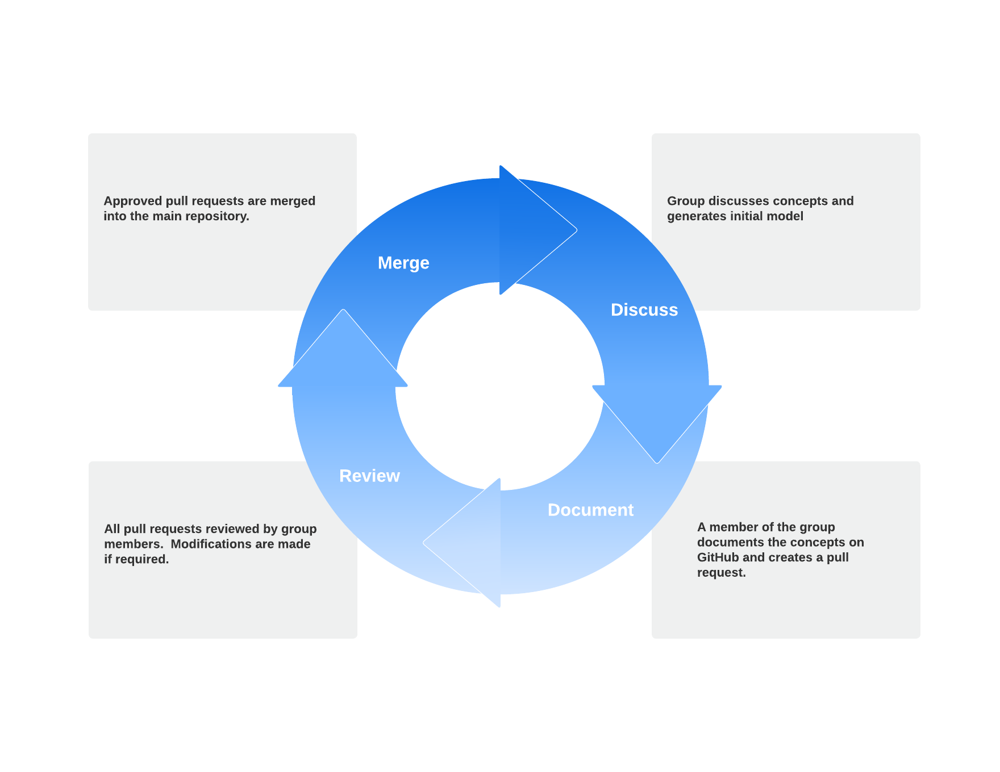

# Ensembl Core Data Model (CDM)

## Introduction
The Ensembl Core Data Model (CDM) describes how the central concepts of Ensembl (Features, genomic locations, external references, metadata etc.) are presented through APIs and services to internal (e.g the 2020 Ensembl website) and external clients (e.g those who interact with Ensembl APIs). The model will aid Ensembl in future development efforts, being compatible with known strategic directions, including Pangenomes.

The diagram below provides an overview of the model.  The image is available in this repository in [./src/images](./src/images/cdm_full.png).  

## Key concepts

The key concepts in the model can be broken into the following categories:-
- Features and related concepts
- Localisation concepts, assemblies, species and organisms
- External references
- Metadata

### Features and related concepts
In the model, [Feature](./src/docs/feature.md) is defined as an abstract concept for modelling areas of interest in a genomic coordinate space.  Typically concrete representations of features have a stable_id for identification.  The term stable_id refers to a publicly available identifier (e.g. ENST00000380152.8) assigned by a project or institute and can be considered to be unique within an Assembly.  

Features in the model are:
- [Gene](./src/docs/gene.md)
- [Transcript](./src/docs/transcript.md)
- [Intron](./src/docs/intron.md)
- [Exon](./src/docs/exon.md)

"Feature-like" entities are also included in the model.  These are not considered to be features because they do not exist in the genomic coordinate space in the same way as a feature, like a gene, does. These concepts include:-
- [cDNA](./src/docs/cdna.md)
- [CDS](./src/docs/cds.md)
- [UTR](./src/docs/utr.md)

[Products](./src/docs/product.md) ([Protein](./src/docs/protein_product.md) and [RNA](./src/docs/rna_product.md)) are included in the diagram of feature-like entities.  However, as they do not occupy the genomic coordinate space, they do not inherit from Feature.  RNA products are not currently available in Ensembl and so have not been fully modelled.  

The transcription and translation event is captured in the [ProductGeneratingContext](./src/docs/product_generating_context.md) (PGC).  The PGC describes the product it is making through the type field, and identifies the features and feature-like entities (gene, transcripts, phased exons, UTRs CDS and cDNA) involved in the process. It also links to the eventual product (if one exists).

[PhasedExons](./src/docs/phased_exon.md) in PGCs allow for identifiable exons to be present in multiple PGCs with additional phase information.
[SplicedExons](./src/docs/spliced_exons) describe the location of identifiable exons in one or more transcripts.

### Localisation concepts, assemblies, species and organisms

A Feature's location is described using [Slice](./src/docs/slice.md), which is the mechanism used to link together [Region](./src/docs/region.md) (a contig or chromosome), [Location](./src/docs/location.md) (coordinates and length) and [Strand](./src/docs/strand.md).   [Sequence](./src/docs/sequence.md) is obtained via Region and allows for integration with RefGet instances via the `checksum` attribute.  Sequence strings are permitted by the model, but discouraged. Region provides the link between an [Assembly](./src/docs/assembly.md) and its sequence.

[Species](./src/docs/species.md) and [Organism](./src/docs/organism.md) are the entities involved in specifying the source of the assembly. Species provides the taxonomic detail (e.g Dog), while Organism provides finer grain information (e.g breeds of dog).  This granularity is provided through [OrganismGroup](./src/docs/organism_group.md), a concept shared with the Metadata Schema.  

### External references
˜
[ExternalReference](./src/docs/external_reference.md) represents a reference to a database outside of Ensembl.

### Metadata

[Metadata](./src/docs/metadata.md) is used to capture information which supports or extends the data held within the model.

CDM separates Metadata into two types:
- ExternalReferenceMetadata
- ValueSetMetadata

#### ExternalReferenceMetadata

ExternalReferenceMetadata is metadata which comes from a source external to Ensembl.  An example of this would be the `name` of a Gene, which could come from VGNC.

#### ValueSetMetadata

ValueSetMetadata is more akin to a well structured controlled vocabulary.  Examples of this would be `biotype` or `APPRIS`.

## Further information

### Development of the CDM

The development of the model has been conducted by a group of staff from the Ensembl project with specialisms in a variety of areas, including:
- Variation genomics
- Comparative genomics
- Genome annotation
- Software & API development

The model has been developed iteratively over a number of months and this work has been influenced by the Ensembl website redevelopment.  The diagram below shows how the requirements of the website have fed into the prioritisation of supporting projects, which in turn have driven the CDM development.  

Within the group, the iterative process has continued.  Github pull requests have been used extensively to ensure all design decisions have had appropriate oversight and approval from group members.

