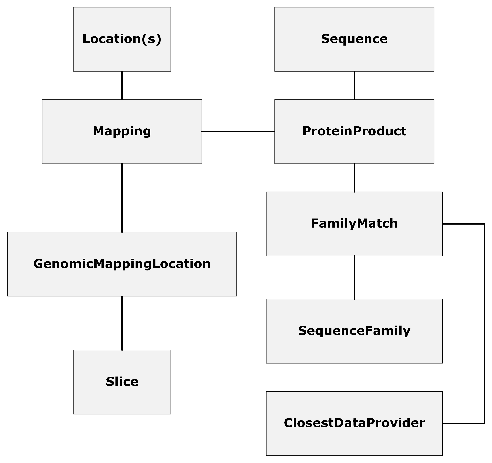

# Ensembl Core Data Model (CDM)

## Introduction
The Ensembl Core Data Model (CDM) describes how the central concepts of Ensembl (Features (such as genes and transcripts), genomic locations, external references, metadata etc.) are presented through APIs and services to internal (e.g the new Ensembl website) and external clients (e.g those who interact with Ensembl APIs). The model will aid Ensembl in future development efforts, being compatible with known strategic directions, including pan-genomes.

## Key concepts

The key concepts in the model can be broken into the following categories:-
- Features (genes, transcripts etc.)
- Localisation concepts, assemblies, species and organisms
- External references
- Metadata

### Features and localisation

#### Features
In the model, [Feature](./src/docs/feature.md) is defined as an abstract concept for modelling areas of interest in a genomic coordinate space.  Typically concrete representations of features have a stable_id for identification.  The term stable_id refers to a publicly available identifier (e.g. ENST00000380152.8) assigned by a project or institute and can be considered to be unique within an [Assembly](./src/docs/assembly.md) .  

Features in the model are:
- [Gene](./src/docs/gene.md)
- [Transcript](./src/docs/transcript.md)
- [Intron](./src/docs/intron.md)
- [Exon](./src/docs/exon.md)

"Feature-like" entities are also included in the model.  These are not considered to be features because they do not exist in the genomic coordinate space in the same way as a feature, like a gene, does. These concepts include:-
- [cDNA](./src/docs/cdna.md)
- [CDS](./src/docs/cds.md)
- [UTR](./src/docs/utr.md)

The transcription and translation event is captured in the [ProductGeneratingContext](./src/docs/product_generating_context.md) (PGC).  The PGC describes the product it is making through the type field, and identifies the features and feature-like entities (gene, transcripts, phased exons, UTRs CDS and cDNA) involved in the process. It also links to the eventual product (if one exists).

[PhasedExons](./src/docs/phased_exon.md) in PGCs allow for identifiable exons to be present in multiple PGCs with additional phase information.
[SplicedExons](./src/docs/spliced_exons) describe the location of identifiable exons in one or more transcripts.

[Products](./src/docs/product.md) ([Protein](./src/docs/protein_product.md) and [RNA](./src/docs/rna_product.md)) are included in this Feature section as they are "Feature-like" in many ways.  However, as they do not occupy the genomic coordinate space, they do not inherit from Feature.  RNA products are not currently available in Ensembl and so have not been fully modelled.  

#### Sequence, localisation concepts, assemblies, species and organisms

Sequence information for Features and "Feature-like" entities is managed in two different ways.

Features with genomic locations have a [Slice](./src/docs/slice.md).  Slice is the mechanism used to link together [Region](./src/docs/region.md) (a contig or chromosome), [Location](./src/docs/location.md) (coordinates and length) and [Strand](./src/docs/strand.md).   [Sequence](./src/docs/sequence.md) is obtained via Region. 

For "Feature-like" entities which have a sequence but do not have a slice or genomic location (e.g. cDNA, [Product](./src/docs/product.md) etc.) the Sequence object is associated with them directly.

Sequence allows for integration with [RefGet](https://github.com/ga4gh/large-scale-genomics-wiki/blob/master/refget.md) instances via the `checksum` attribute.  Region provides the link between an [Assembly](./src/docs/assembly.md) and its sequence.

[Species](./src/docs/species.md) and [Organism](./src/docs/organism.md) are the entities involved in specifying the source of the assembly. Species provides the taxonomic detail (e.g Triticum aestivum), while Organism provides more granular information about an individual or cultivar (e.g Jagger (wheat cultivar)).  This granularity is provided through [OrganismGroup](./src/docs/organism_group.md), a concept shared with the Metadata Schema.

### External references

[ExternalReference](./src/docs/external_reference.md) represents a reference to a database outside of Ensembl.

### Metadata

[Metadata](./src/docs/metadata.md) is used to capture information which supports or extends the data held within the model.

CDM separates Metadata into two types:
- [ExternalReferenceMetadata](./src/docs/external_reference.md) 
- [ValueSetMetadata](./src/docs/value_set.md)

#### ExternalReferenceMetadata

ExternalReferenceMetadata is metadata which comes from a source external to Ensembl.  An example of this would be the `name` of a Gene, which could come from [VGNC](https://vertebrate.genenames.org/).

#### ValueSetMetadata

ValueSetMetadata is more akin to a well structured controlled vocabulary.  Examples of this would be `MANE Select` or `MANE Plus Clinical`.

## Further information

### Development of the CDM

The development of the model has been conducted by a group of staff from the Ensembl project with specialisms in a variety of areas, including:
- Variation genomics
- Comparative genomics
- Genome annotation
- Software & API development

The model has been developed iteratively over a number of months and this work has been influenced by the Ensembl website redevelopment.  The requirements from the website and related services have been fed into the CDM group's regular meetings where they have been discussed, designed, documented and reviewed.

The CDM has been used as the basis for our new API development.  This ensures that the concepts used are well understood and this will reduce divergence, creating a common nomenclature for key ideas across the project.

### Versioning

The CDM uses semantic versioning.  This is managed through Git tags. 

### Issues

Issues with the CDM are tracked using Github issues.  Alternatively, the Ensembl team can be contacted using the "contact us" link.